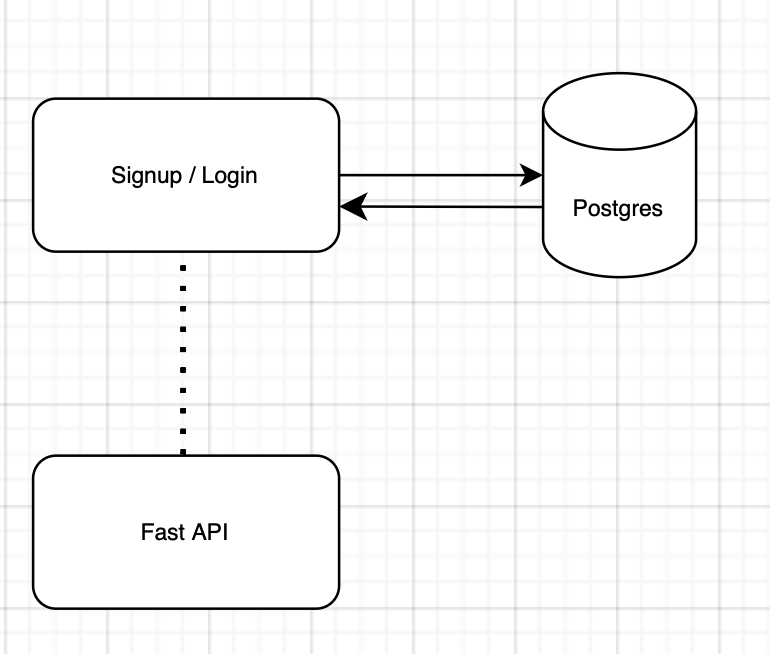

# code-life

Signup/ Login Module

The FastAPI is used to develop the REST APIs for signup and login APIs

PostgreSQL is used as a database

The CRUD operations that are performed by the login or signup page will be bear by the database. 

The Users table in the database will store the user details, the password is encrypted before writing into the database. 